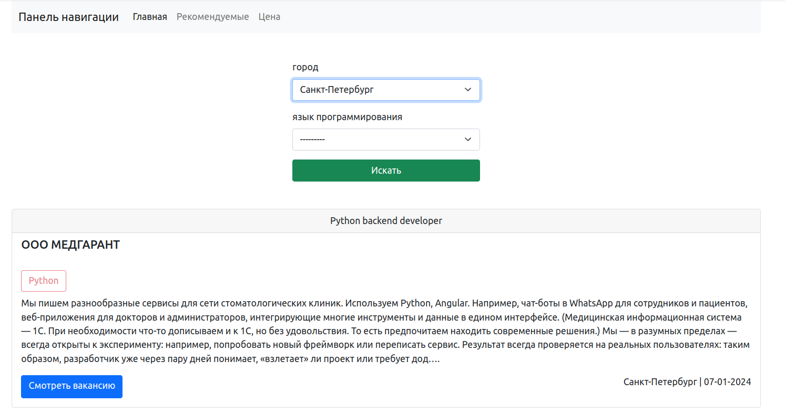

# Веб-скрепинг на Django для размещения вакансий

# Задачи

- [x] Переопределение модели пользователя
- [x] Отображение списка вакансий с api.hh.ru/
- [x] Регистрация и авторизация
- [x] Форма обновления данных профиля пользователя
- [x] Настройка почты для отправки писем через SMTP 
- [x] Создание переменных окружения
- [ ] Пагинация
- [ ] Система информирования
- [ ] Отправка писем подписчикам
- [ ] Форма обратной связи
- [ ] Отправка информации админу
- [ ] Отправка писем подписчикам

#  Инструменты
- Python 3.10
- Django
- Bootstrap5
- Docker
- Celery
- Redis

